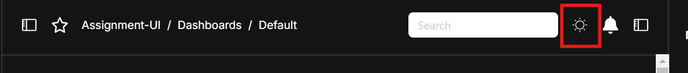
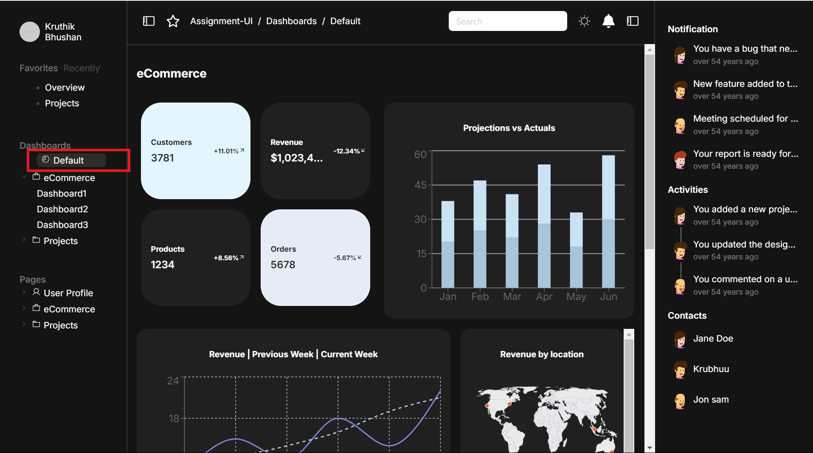
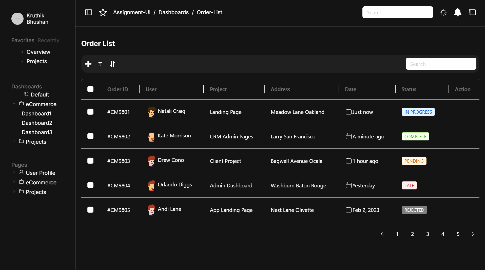
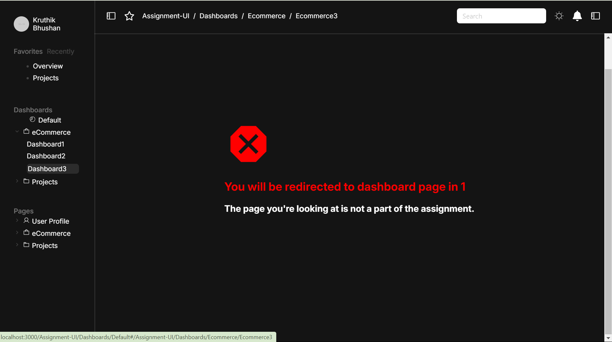
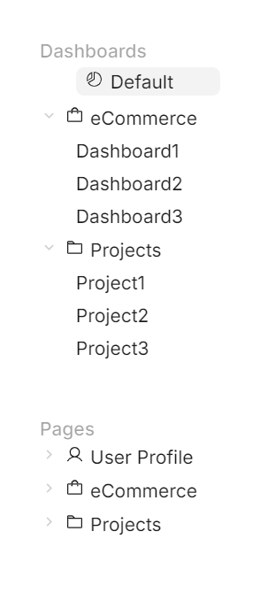
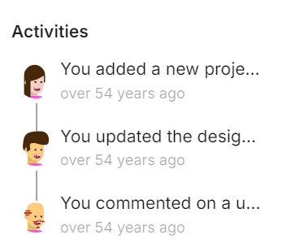

# Getting Started with Application

This project was bootstrapped with [Create React App](https://github.com/facebook/create-react-app).

## Available Scripts

Clone the project and then do the following steps:

### `npm start`

Runs the app in the development mode.\
Open [http://localhost:3000](http://localhost:3000) to view it in your browser.

The page will reload when you make changes.\
You may also see any lint errors in the console.

### `npm run build`

Builds the app for production to the `build` folder.\
It correctly bundles React in production mode and optimizes the build for the best performance.

The build is minified and the filenames include the hashes.\
Your app is ready to be deployed!

### `npm run deploy`

deploy the app for production using the recent build files. This deploys the application in github pages.

## Branching Strategy 

`Master` branch has the final code changes.  
`gh-pages` branch only has build files and is deployed in Github Pages.  

(Note: Kindly ignore the `main` branch)

## About Assignment

The application is developed as per the given figma - (https://www.figma.com/design/XBEbJlKyCR4kdwlhJvzAUS/UI-Developer-Assignment?node-id=4-2496&node-type=section&t=7DB9YCJUReKLOs93-0) 

(Note - Considering that this is just a UI task most of the buttons/links are non-functional. Only implemented to match the figma design)

### Functionalities 

- Dark and Light Theme for Application. 

  Button of action 

   

- Default Dashboard Page - https://nkruthikbhushan2000.github.io/Assignment-UI/#/Assignment-UI/Dashboards/Default. By clicking on Default option in the sidebar menu we can navigate to Default Dashboard. 

 

- Order List Page - https://nkruthikbhushan2000.github.io/Assignment-UI/#/Assignment-UI/Dashboards/Order-List. By clicking on Order-list option in the sidebar menu we can navigate to Order List page. 

- Search, Pagination and Enabling/Disbaling the Checkbox for each item in the Order List is functional.

- Naviagting to any other links or location will result in the following page which will redirect to default dashboard within 3 seconds.

- All maps and graphs are designed to be user-friendly and intuitive, ensuring a seamless experience for users.

- Animations are added for graphs and other components in dashboard page. 

- The menu bar and notification bar can be closed and opened by clicking on buttons in the top bar.

### Challenges Faced

- <u>BrowserRouter Compatibility</u>:  
When deploying the project on GitHub Pages, `BrowserRouter` did not function as expected. Based on GitHub's recommendation, I switched to `HashRouter`, which required some adjustments in the code to ensure proper routing.

- <u>Limited Experience with Recharts</u>: 
I had limited experience with the React JS library `Recharts`, which made it challenging to create graphs that closely matched the designs provided in Figma.

- <u>Custom Component Development</u>: 
Several components had to be built from scratch because they were either unavailable in any existing UI libraries or didn’t match the Figma designs. Notable examples include the `Activities sectio`n in the right sidebar and the `menu` in the left sidebar.

- <u>Event Propagation Issues</u>: 
A challenge arose in handling event propagation from child to parent components, specifically in the `RecursiveFolder` component's onClick event handler. The issue involved the `NavLink` (child) and the `li` (parent) elements, where I had to prevent unwanted bubbling of events.

- <u>Limited Experience with CSS animations</u>:
Making sure that animation happen after the data is loaded or after the promise has executed successfully. Learnt about requestAnimationFrame in react.

### Libraries Used 

- <b>Recharts</b>: A powerful charting library for React that simplifies the creation of highly customizable and responsive charts, ideal for visualizing complex data in a user-friendly manner.

- <b>react-simple-maps</b>: A library for building interactive SVG maps using React, offering an easy and lightweight solution for creating customizable maps with a focus on simplicity and ease of use.

- <b>Ant Design (antd)</b>: A popular UI component library that provides a comprehensive set of high-quality, customizable components designed to improve the speed and consistency of building modern web applications.

### Key React and JavaScript Concepts Utilized

- <b>JavaScript Promises</b>: Used to simulate API call delays by returning data after a fixed 2-second timeout, mimicking real-world asynchronous operations like loading states.

- <b>Redux</b>: Employed for centralized state management across the application, handling the states of the `Default Dashboard` and `Order-List` pages to ensure efficient and scalable state handling.

- <b>Context API</b>: Leveraged `useContext` to create a global context for managing theme changes, enabling seamless theme switching across the entire application.

